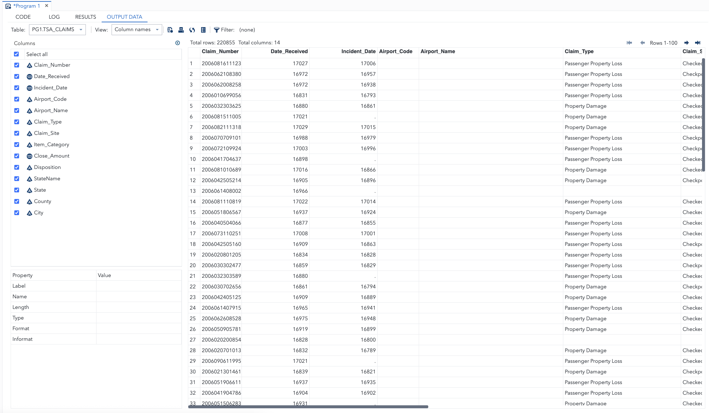
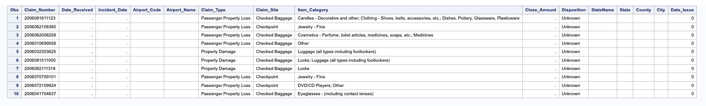
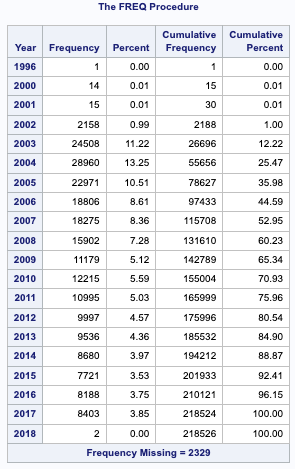
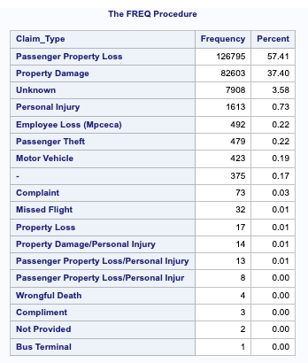
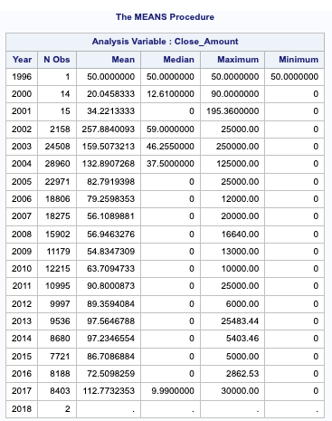
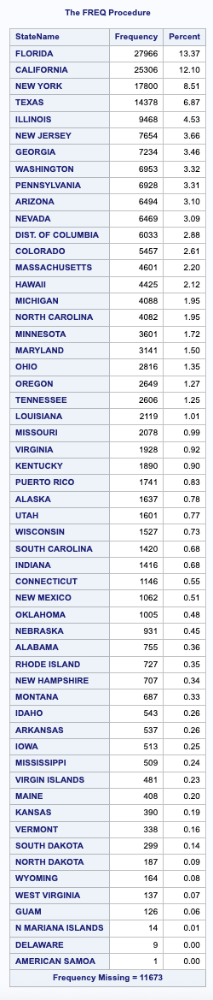

# ✈️ TSA Claims Analysis (2002–2017)

This project explores TSA claims data from 2002 to 2017 to uncover patterns in incident frequency, claim types, monetary payouts, and geographical hotspots. The analysis was conducted using **SAS OnDemand for Academics**, focusing on data wrangling, statistical summarization, and trend analysis.

## 🎯 Objective

The goal of this case study is to clean and analyze real TSA claim data to identify:
- Which types of claims are most common
- How TSA claims have changed over time
- Which states report the most incidents
- Yearly trends in reimbursement amounts

---

## 🧰 Tools Used

- **SAS Studio (SAS OnDemand for Academics)**
- PROC IMPORT, DATA step, PROC FREQ, PROC MEANS, PROC PRINT
- Data cleaning with COALESCEC, PROPCASE, and date formatting

---

## 📦 Dataset

- **File:** `TSAClaims2002_2017.csv`  
- **Rows:** ~220,000  
- **Variables:** 14, including `Incident_Date`, `Claim_Type`, `Close_Amount`, `Disposition`, `StateName`, and more.

---

## 🔧 Data Preparation

- Imported and converted raw CSV data into a SAS dataset
- Cleaned missing or unknown values and standardized text formatting
- Flagged date inconsistencies and extracted incident year for trend analysis

**Preview of Raw vs. Cleaned Data:**

| Raw CSV Preview                            | Cleaned Data View                            |
|--------------------------------------------|----------------------------------------------|
|           |          |

---

## 📊 Key Analyses

### 1. 📈 TSA Claim Volume by Year
Shows how reported claims have fluctuated from 2002–2017.



---

### 2. 🧾 Most Common Claim Types
Highlights the top reasons for TSA claims (e.g., baggage damage, theft).



---

### 3. 💸 Average Payout Trends by Year
Displays payout statistics including mean, median, min, and max.



---

### 4. 🗺️ Geographic Distribution of Claims
Identifies which U.S. states have the most TSA claims.



---

## 📁 Project Structure

```
tsa-claims-case-study/
├── tsa_claims_analysis.sas         # Cleaned + annotated SAS script
├── TSAClaims2002_2017.csv          # Original dataset
├── /img/
│   ├── raw_data_preview.png
│   ├── cleaned_data_preview.png
│   ├── claims_volume_trend_by_year.png
│   ├── most_common_claim_types.png
│   ├── average_payout_by_year.png
│   └── claims_by_state_distribution.png
└── README.md                       # You're here
```

---

## ✅ Takeaways

- TSA claim frequency decreased significantly after the mid-2000s.
- Most claims stem from baggage issues and theft.
- Payouts vary widely, with some states seeing much higher volumes.
- Clean data is essential — over 2,000 records had invalid or missing dates.

---

## 🧠 Skills Demonstrated

- Data importation and conversion in SAS
- Data cleaning and preprocessing using DATA steps
- Exploratory analysis using PROC FREQ, PROC MEANS
- Date manipulation and error detection
- Generating publication-ready visuals from SAS outputs

---

## 🔗 Related Projects

You can also view my Tableau companion project here:  
👉 [Superstore Sales Tableau Dashboard](https://public.tableau.com/app/profile/bryce.smith4541/viz/SuperstoreSalesPerformanceAnalysis_17497681544780/SuperstorePerformanceProfitSalesRegionalTrends)

---

## 📬 Contact

For questions, feel free to connect via [LinkedIn](https://www.linkedin.com/in/brycesmith15) or [email](mailto:brycesmith15@gmail.com).
